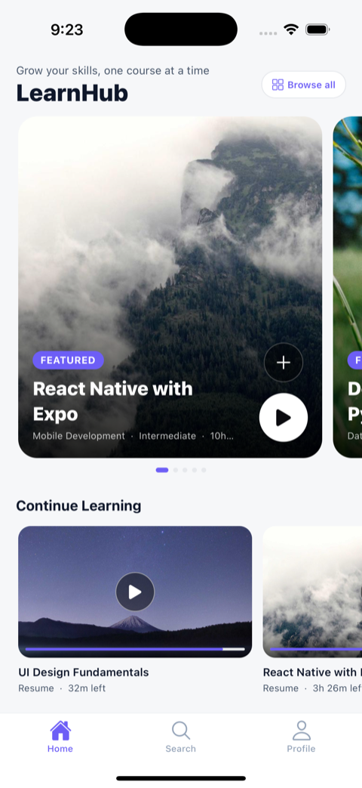
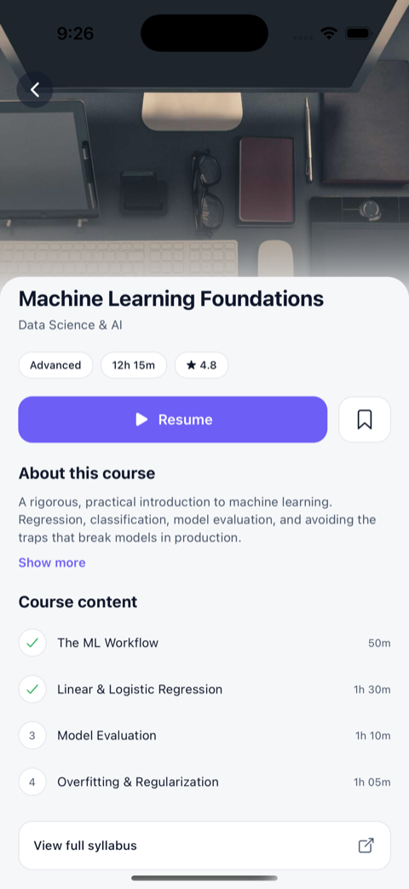
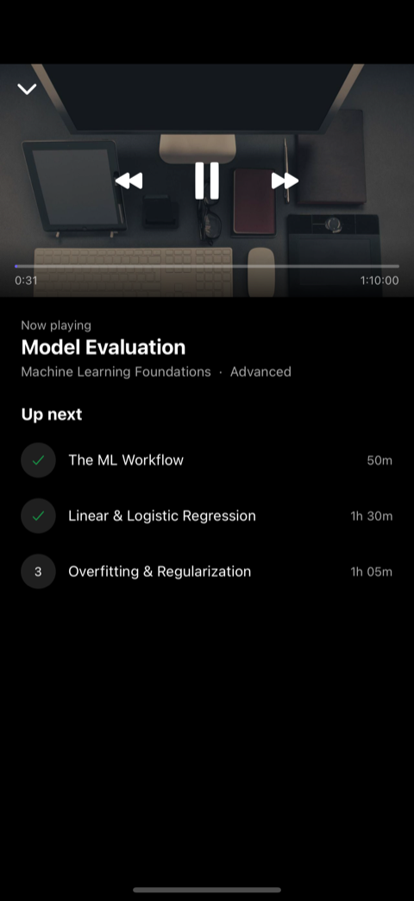
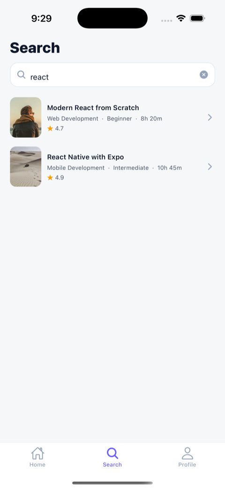
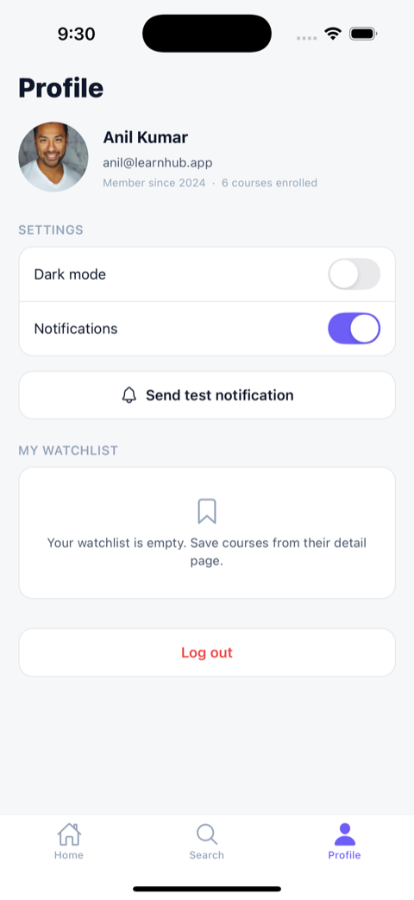
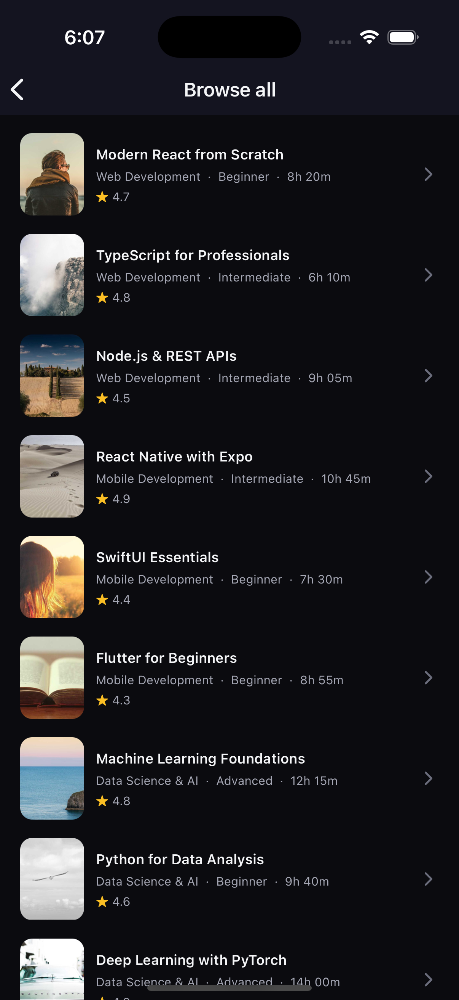
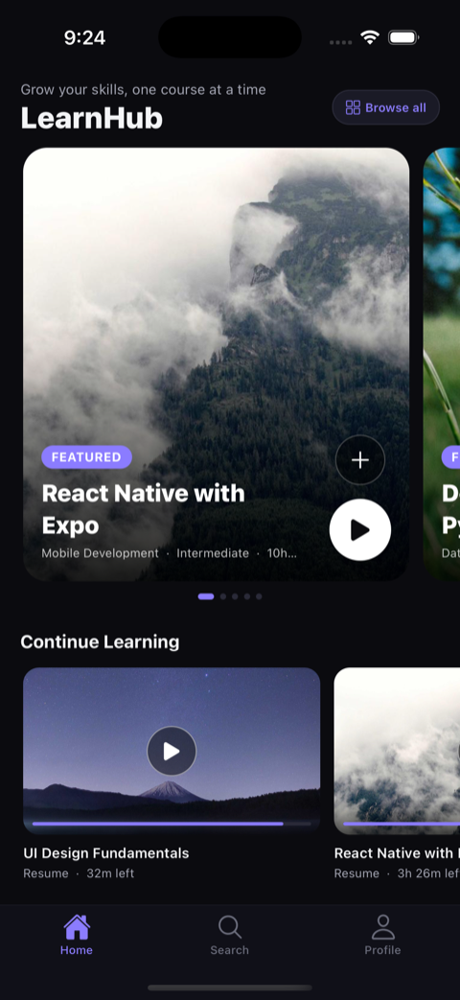
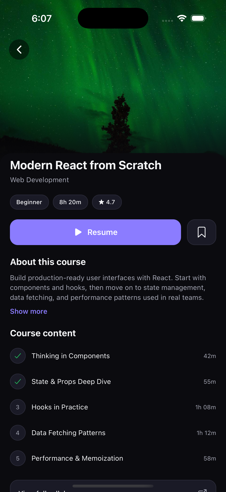
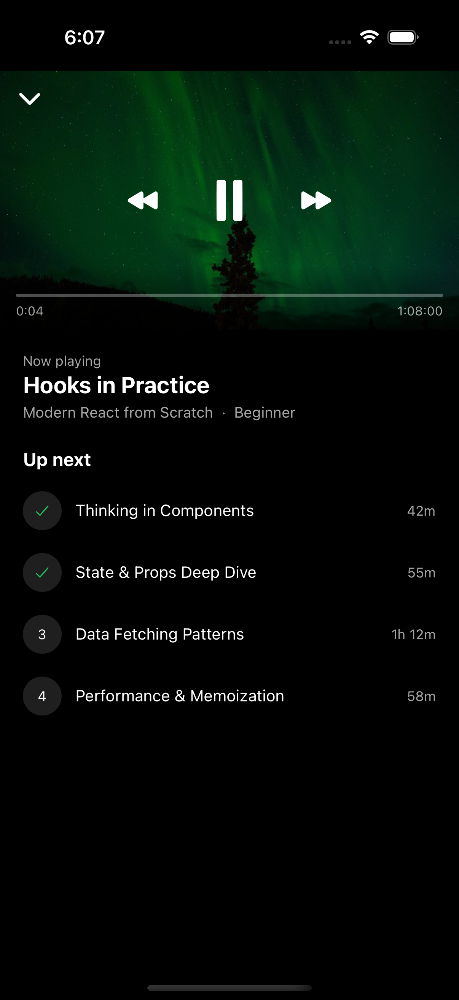

# LearnHub 

A **mobile-first Learning Management System** built with React Native (Expo) — designed like a
**streaming app** (think Hotstar/Netflix) but reimagined for courses. The hero is a featured
course, carousels are categories, "Continue Watching" becomes "Continue Learning", and the
player surface plays lessons. That mapping keeps a polished, familiar UX while modelling a real
product: **discover → detail → play → track progress.**

> Built for a React Native / Expo take-home. Fully typed, data-driven, and tuned for performance.

---

##  Screenshots

|  Home  |  Course Detail  |  Player  |
| :----: | :-------------: | :------: |
|  |  |  |

|  Search  |  Profile  |  Browse (infinite scroll)  |
| :------: | :-------: | :------------------------: |
|  |  |  |

###  Full dark mode

|  Home  |  Detail  |  Player  |
| :----: | :------: | :------: |
|  |  |  |

---

##  What it does

- **Home** — a swipeable, edge-peek **hero** with Play / Add buttons, a **Continue Learning**
  resume rail (progress + time left), a **Top Courses** ranked list with category filter chips,
  and category rows.
- **Course Detail** — a Reanimated **collapsing/parallax header**, metadata chips, a
  progress-aware **Resume/Enroll** button, a **watchlist** toggle, an expandable About, the
  module list with completion state, related courses, and a **WebView** syllabus link.
- **Player** — an immersive **Now Playing** screen: play/pause, ±10s skip, a scrubber with a
  live timer, and an up-next module list.
- **Search** — **debounced** search with prompt / loading / empty / error states.
- **Profile** — mock user, **dark-mode** and notifications toggles, a **test notification** that
  **deep-links** into a course when tapped, watchlist section, and logout.
- **Everywhere** — light/dark theming, **skeleton loaders**, pull-to-refresh, **infinite scroll**,
  haptics, press animations, and a WebView ↔ RN `postMessage` bridge

---

##  Tech stack

| Area | Choice |
| --- | --- |
| Framework | **Expo SDK 57** (managed / CNG), React Native 0.81, React 19 |
| Language | **TypeScript** (strict, `noUncheckedIndexedAccess`) |
| Styling | **NativeWind v4** — design tokens via CSS variables |
| Navigation | **React Navigation v7** (native stack + bottom tabs) |
| Server state | **@tanstack/react-query** v5 |
| Client/UI state | **zustand** (theme, watchlist) |
| Animation | **Reanimated v4** |
| Images | **expo-image** (blurhash placeholders) |
| Component lib | **React Native Paper** (themed Switch) |
| Also | expo-linear-gradient, masked-view, react-native-webview, expo-notifications, expo-haptics |
| Testing | **Jest** (`jest-expo`) + **React Native Testing Library** |

---

##  Run it locally

```bash
npm install

npm run ios          # or: npm run android   (development build)
npm test             # unit tests
npm run typecheck    # tsc --noEmit
```

> **Why a development build (not Expo Go)?** On this toolchain, Expo Go 57 crashes at startup on
> the iOS simulators (native issues in `expo-notifications` / `react-native-worklets` — not app
> code). A dev build compiles the native modules at matching versions and runs cleanly. It's
> still the **managed / CNG** workflow: `ios/` and `android/` are git-ignored, regenerated by
> `expo prebuild`, and `app.json` stays the single source of truth. For a shareable build, use
> **EAS** (`eas build -p android --profile preview`).

---

##  How it's built

> **Full engineering deep-dive:** [`docs/TECHNICAL.md`](docs/TECHNICAL.md) — architecture,
> the React Query + Zustand split, component-library choice, theming, performance tuning, and
> build/runtime decisions.

```
src/
  services/    mock API (course / user / notification) — the ONLY place that reads seed JSON
  hooks/       React Query hooks that bridge services -> UI
  store/       zustand (theme, watchlist)
  screens/     Home · Detail · Player · Search · Profile · Browse · WebView
  components/  presentational, prop-driven, reusable
  theme/       design tokens + ThemeProvider
  constants/   strings (all UI copy) + images
  utils/       delay (mock network), format, haptics
  data/        seed JSON
```

**One clear rule for the data flow:** *screens orchestrate, components render from props,
services fetch, hooks bridge.* Only the **service layer** touches the seed data — so swapping the
mock for a real API wouldn't change a single screen. Every string lives in `constants/strings.ts`;
there are no hardcoded strings (or colors) in components.

**Why React Query *and* Zustand?** They solve different problems:

- **React Query = server state** (course data). Caching, loading/error flags, `refetch`, and
  pagination come for free.
- **Zustand = local UI state** (theme, watchlist). Synchronous, no server — a tiny store is the
  right tool, and it avoids prop-drilling.

> Rule of thumb: *from the server → React Query; local UI → Zustand.*

**Theming** — `theme/tokens.ts` is the single source of truth. `ThemeProvider` injects the active
palette as **NativeWind CSS variables** *and* exposes raw hex to imperative consumers (navigation,
StatusBar, icons). Flipping the theme rebuilds the variables, so the whole app re-themes instantly.

**Component library** — the brief asked for Gluestack UI, with **React Native Paper as the
sanctioned fallback**. On this bleeding-edge stack Gluestack's setup was risky, so Paper powers
the required primitive (the Profile `Switch`, themed from our tokens) and everything visual stays
custom — exactly as the brief allows.

---

##  Performance

- Stable `keyExtractor={(i) => i.id}` (never index); `renderItem`/cards are memoized.
- `getItemLayout` wherever item size is fixed, so lists skip async measurement.
- Tuned FlatList windowing per list (small windows for short horizontal rows; ~one screen up
  front for vertical lists).
- `expo-image` with blurhash placeholders and a cross-fade transition.
- `useMemo` only where there's real derived cost.

*(The mock service adds a real network delay so loading/skeleton/error states are genuinely
exercised — flip `networkConfig.failureRate` in `src/utils/delay.ts` to see the error paths.)*

---

##  Testing

`npm test` — Jest + React Native Testing Library:

- **courseService** — resolves typed data; rejects with `NetworkError` when the failure rate is 1.
- **format utils** — percent, rating, duration parsing, time-left, clock.
- **CourseCard** — renders the title and fires `onPress`.

---

##  What I'd do next

- **Persistence** — `zustand/persist` + AsyncStorage for watchlist & theme; hydrate React Query
  for offline-first.
- **Real backend & playback** — swap the mock service for a real API (consumers don't change),
  and drop `expo-video` into the player surface.
- **More tests** — Home skeleton→content integration test and an E2E for the notification →
  deep-link flow.
- **CI** — GitHub Actions running `typecheck` + `test`.
